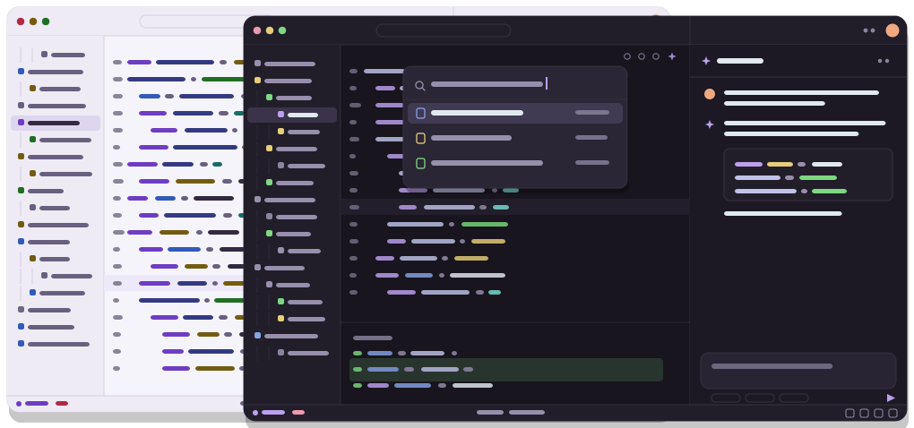
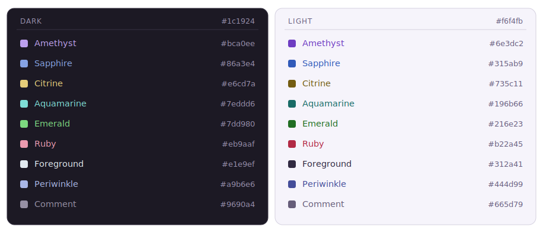

# Geode

**A gem-toned theme for [Zed](https://zed.dev).**
Color only where it carries meaning — dark and light, cut from the same stone.

Geode Light (back) · Geode (front)

## Why Geode

Most dark themes color everything. Geode does the opposite: the canvas is a quiet, violet‑tinted stone, and color is spent only on the tokens worth finding — keywords, types, functions, strings and values. Variables, parameters and properties stay neutral, so your eye lands where the logic is.

A few principles hold the palette together:

- **Amethyst leads.** It's the signature accent and runs through the whole UI — selection, focus, the active line — so the editor feels of one piece.
- **The gems are a set, not a scatter.** Every accent shares one tonal level and stays at least 40° apart in hue, in both variants.
- **One color, one meaning.** Ruby is reserved for things that went wrong — errors and removed lines — so it never cries wolf on an ordinary number.
- **Readable everywhere.** Every meaningful token clears WCAG AA contrast in both cuts, including on top of selections and search highlights.

## Palette

The light cut keeps the same hues as the dark one and only darkens each gem as far as a pale background needs — yellows and teals deepen into bronze and forest rather than washing out.

## Install

**From the Zed registry**

1. Open the command palette — <kbd>Cmd</kbd>/<kbd>Ctrl</kbd> <kbd>Shift</kbd> <kbd>P</kbd> — and run `zed: extensions`.
2. Search for **Geode** and install.
3. Run `theme selector: toggle` and pick **Geode** or **Geode Light**.

**By hand**

Copy `themes/geode.json` into `~/.config/zed/themes/`, then select it from `theme selector: toggle`.

## Development

Geode is a pure theme — no Rust, no build step. The whole thing lives in one file, `themes/geode.json`, written against Zed's theme schema `v0.2.0`.

1. Run `zed: install dev extension` and point it at this folder.
2. Edit the JSON, then `zed: reload extensions` to see changes live.

> Close `geode.json` in Zed before editing it from another tool — an open editor buffer will overwrite your changes when it saves.

## Contributing

Issues and pull requests are welcome. [`CONTRIBUTING.md`](./CONTRIBUTING.md) covers local setup and the rules that keep the palette coherent. Changes that affect how colors look should include a before/after note.

## License

[MIT](./LICENSE) © Almela
